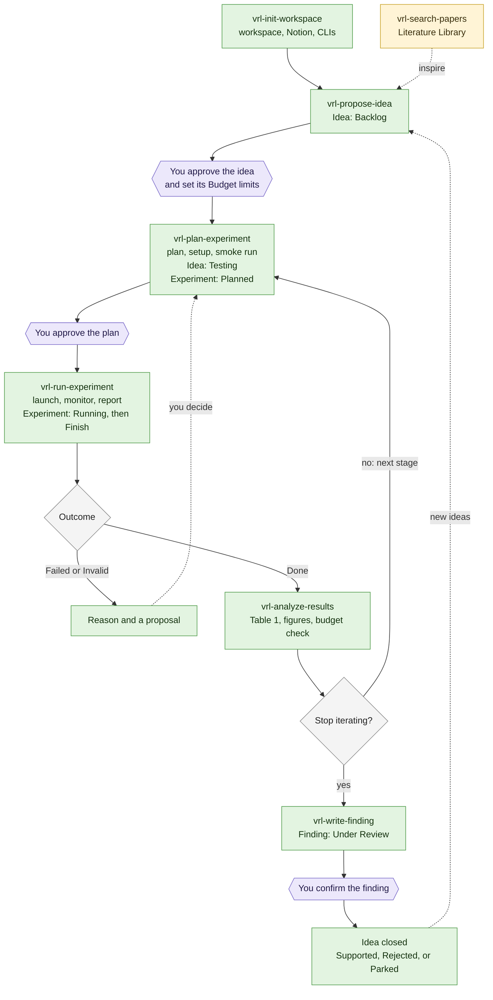

# vibe-research-loop-skills

Agent skills for the vibe-research-loop guide, the research workflow in which AI coding agents run the experiment loop and the user makes the decisions. Each skill is a folder under [`skills/`](skills/) with a `SKILL.md`, in the Agent Skills format that both Claude Code and Codex load.

| Skill | What it does | Invoked by |
|---|---|---|
| [`vrl-init-workspace`](skills/vrl-init-workspace/SKILL.md) | Sets up the workspace, the Notion CLI and pages, and optionally a Hugging Face bucket, or adds a machine to them, from the guide's setup prompts | The user only |
| [`vrl-propose-idea`](skills/vrl-propose-idea/SKILL.md) | Writes a testable hypothesis into Ideas, for the user to approve | The user or the agent |
| [`vrl-plan-experiment`](skills/vrl-plan-experiment/SKILL.md) | Plans the next experiment of an approved idea, for the user to approve | The user or the agent |
| [`vrl-run-experiment`](skills/vrl-run-experiment/SKILL.md) | Launches and monitors the approved runs, then closes the experiment with its outcome | The user or the agent |
| [`vrl-analyze-results`](skills/vrl-analyze-results/SKILL.md) | Fills the results and conclusion of a finished experiment | The user or the agent |
| [`vrl-write-finding`](skills/vrl-write-finding/SKILL.md) | Drafts a finding from an idea's experiments, or from any verified result such as a performance test, for the user to confirm, then closes the idea it resolves, if any | The user or the agent |
| [`vrl-search-papers`](skills/vrl-search-papers/SKILL.md) | Adds at most three papers per search to the Literature Library | The user or the agent |

## Install in one prompt

Paste this into Claude Code or Codex, and approve the command when the agent asks: it needs the network and writes to `~/.agents` and `~/.claude`, outside the project.

```text
Install the vibe-research-loop skills by running `curl -fsSL https://raw.githubusercontent.com/Beat-in-our-hearts/vibe-research-loop-skills/main/install.sh | bash`, then tell me which skills it installed, anything it left alone, and the next step it prints.
```

To install by hand, or to update or remove the skills, see [Installing](#installing).

## Installing

Once per machine, run the installer. It needs only `curl` and `tar`, no sudo and no clone: it downloads the latest release to a temporary folder, copies each skill into `~/.agents/skills`, which Codex reads, and links it from `~/.claude/skills`, which Claude Code reads:

```bash
curl -fsSL https://raw.githubusercontent.com/Beat-in-our-hearts/vibe-research-loop-skills/main/install.sh | bash
```

Run it again to update; it also removes skills a newer release dropped. When a skill starts, it checks for a newer release, asking GitHub at most once a day, and tells you if there is one; it never updates on its own. Only releases this installer put in place are checked, not a branch or commit, nor an install by other means such as `skills` below. Add `-s -- --version v0.1.0` after `bash` to install a given tag, branch, or commit, or `-s -- --uninstall` to remove the skills. It replaces only folders it installed itself, and links to an old clone of this repository; it reports any other folder with a skill's name and leaves it alone. Start a new session if a skill does not show up.

With Node.js, [`skills`](https://github.com/vercel-labs/skills) installs them too: `npx skills add Beat-in-our-hearts/vibe-research-loop-skills -g -a claude-code -a codex --all`.

The skills use four CLIs: `uv`, `ntn` (Notion), `gh` (GitHub), and `hf` (Hugging Face). `vrl-init-workspace` installs them and logs in to them; to do that without an agent, run its script in a terminal. It needs no sudo and installs into `~/.local/bin`; add `check` to see what is installed and logged in, `install --upgrade` to upgrade them to their latest releases, or `--only ntn,gh` for a subset:

```bash
bash ~/.agents/skills/vrl-init-workspace/scripts/setup_clis.sh
```

## Workflow



Green steps are what the agent does, each with the Notion status it leaves behind. Purple steps wait for you: nothing past them runs until you act. Each experiment runs one stage of the idea, or the part of it that fits the budget left. The agent stops iterating on an idea when the success criteria are met, a Budget limit is reached, or several experiments in a row bring no improvement. Dashed arrows are the loops back: papers and closed ideas inspire new ideas, and a failed or invalid run goes back to planning once you decide how. vrl-search-papers also runs daily and after each experiment, to look for related work.

## Using

| Agent | Invoke a skill |
|---|---|
| Claude Code | `/vrl-plan-experiment`, followed by any details |
| Codex | `$vrl-plan-experiment`, followed by any details |

The agent also picks a research skill on its own when a request matches its description; `vrl-init-workspace` runs only when the user invokes it.

- Run `vrl-init-workspace` first, once per machine. It carries its own copy of the guide, so the guide never needs to be cloned. The research skills rely on the workspace's rules and on the page templates in that guide, so the Notion databases need no templates of their own: each new page starts from its database's template, whose gray instructions say what goes where. Once they fill a section, they delete its instructions from the page and keep only the content.
- The research skills write Notion pages in the reply language, unless the workspace's language rules set another one for Notion, but use the English names of the Notion databases and properties, the ones `vrl-init-workspace` creates.
- Start the agent from the workspace root; the research skills stop anywhere else.
- The research skills keep the IDs of the Notion project page and databases in the workspace's `docs/notion/ids.md`.

## Reviewing a Notion page

Review a page the agent wrote by coloring its text, either the text itself or its background, in the Notion app. Before every write, the research skills read these colors, table cells included, and answer each mark:

| Color | You mean | The agent |
|---|---|---|
| 🔴 Red | This is wrong | Fixes it, and says what it changed and why |
| 🟠 Orange | I did not understand this | Explains it in plainer words, and rewrites it so that it no longer needs the explanation |
| 🟣 Purple | I cannot accept this | Proposes an alternative, and leaves the text and its mark until you decide |

Rewritten text loses its mark; a mark the agent has not resolved stays in place. Other colors carry no meaning, such as the blue background of an idea's line of thought.

## Remote mode

When the machine you run the agent on has no GPU and jobs run on a remote host over SSH, such as an HPC container, choose remote mode in `vrl-init-workspace`. Its prompts live in [`skills/vrl-init-workspace/references/remote/`](skills/vrl-init-workspace/references/remote/), outside the bundled guide, so that refreshing the guide leaves them alone.

| | Local machine: the launch directory | Remote host: the remote workspace |
|---|---|---|
| Files | `AGENTS.md`, `docs/AGENTS/` (with `remote.md`), and an SSHFS mount of the remote workspace | Everything else: `.env`, code, `docs/plans/`, `docs/notion/ids.md`, `logs/`, `runs/`, `tests/`, … |
| Commands | File edits, `ssh`, `ntn`, web requests, git of the rules | Everything else, through one SSH master and a tmux session |
| Git | The rules repository | The workspace repository |

The remote host is named by an alias in your `~/.ssh/config`, such as `gpu-box`, so a jump host or a key works as it does in your own `ssh`; if you have none, the setup adds one with your approval. The research skills switch to remote mode whenever `docs/AGENTS/remote.md` exists in the launch directory. Mount the remote workspace before starting a session there.

## Compatibility

| | Claude Code | Codex |
|---|---|---|
| Personal skill folder | `~/.claude/skills/` | `~/.agents/skills/` |
| Skills only the user invokes | `disable-model-invocation: true` in `SKILL.md` | `policy.allow_implicit_invocation: false` in `agents/openai.yaml` |
| `agents/openai.yaml` | Ignored | Display name, short description, default prompt, and invocation policy |

Each agent ignores the other's settings, so one folder serves both.

## Maintaining

`skills/vrl-init-workspace/references/guide/` is a copy of the English guide's committed files. After the guide changes, replace the copy with the guide's latest commit, then commit it here with that commit's hash in the message:

```bash
rm -rf skills/vrl-init-workspace/references/guide && mkdir -p skills/vrl-init-workspace/references/guide && git -C <guide checkout> archive HEAD | tar -x -C skills/vrl-init-workspace/references/guide
```

## License

[MIT](LICENSE), © 2026 Zuxing Lu.
