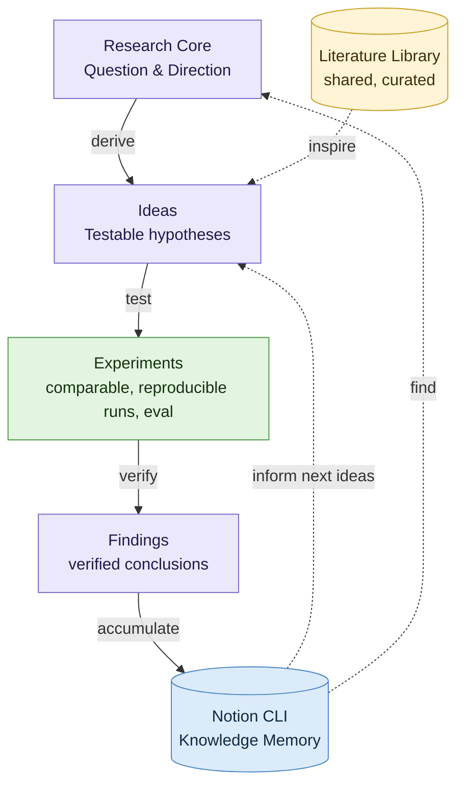

# Research loop

## Legend

| Mark | Meaning |
|---|---|
| Purple | Human-In-Loop: set the direction, approve ideas, confirm findings |
| Green | AI-autonomous: run and compare experiments |
| Blue | Knowledge Memory: the project's Notion knowledge base, used through the Notion CLI |
| Yellow | Literature Library: shared by all projects, curated, feeds new ideas |
| Solid arrows | The forward chain: derive, test, verify, accumulate |
| Dashed arrows | The loops back to Ideas and the Research Core, and literature feeding Ideas |
